# Insight TG Bot

**[Русская версия](README.ru.md)**

Telegram bot for analyzing public channels — word clouds, sentiment, activity heatmaps, personality mentions, phrases, emoji stats, and more.

Try it: [@insight_tg_bot](https://t.me/insight_tg_bot)

## Example Output

<p align="center">
  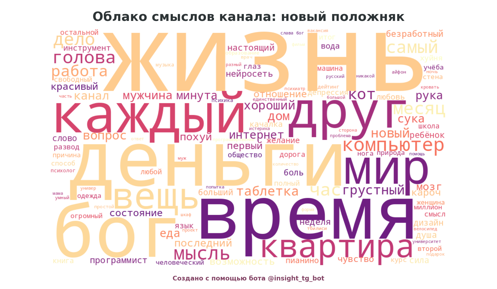
  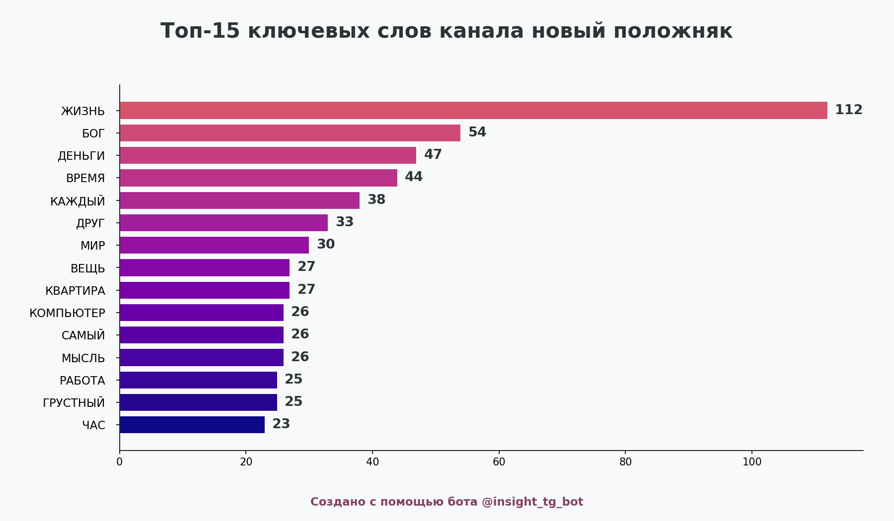
</p>
<p align="center">
  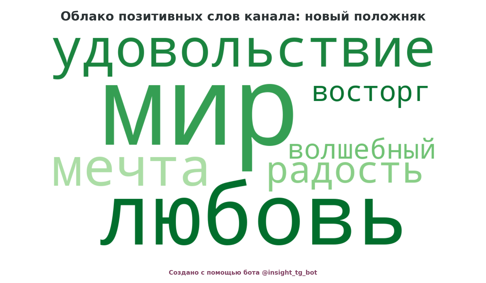
  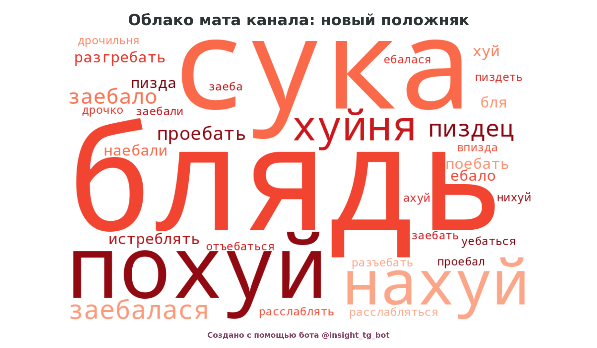
</p>
<p align="center">
  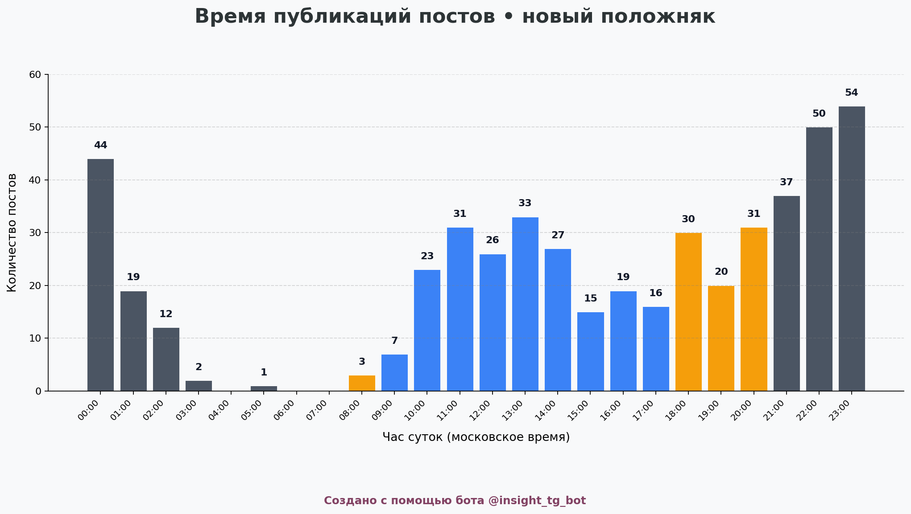
  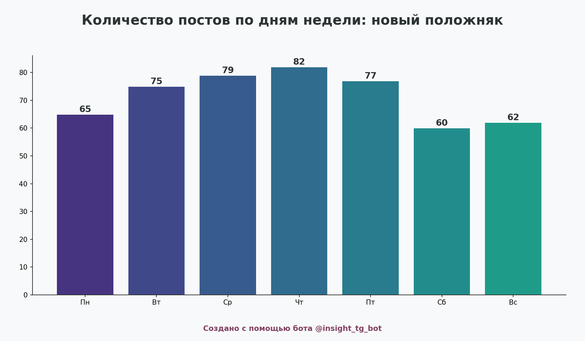
</p>
<p align="center">
  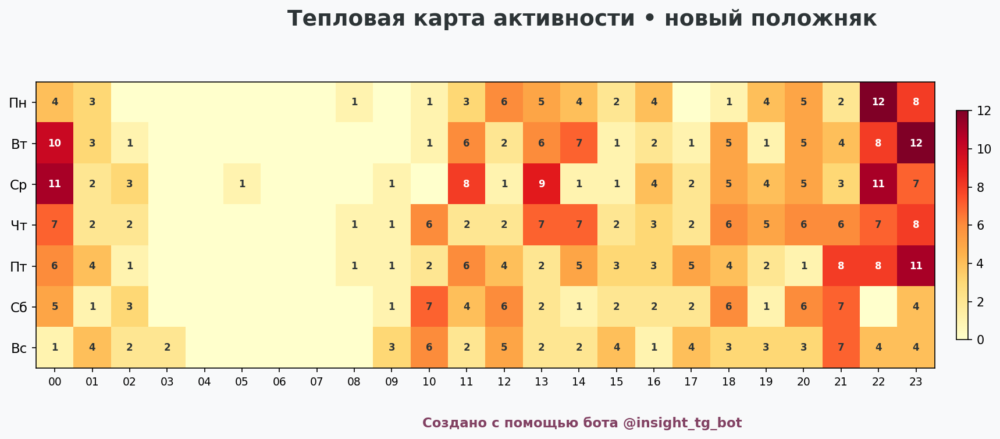
  
</p>
<p align="center">
  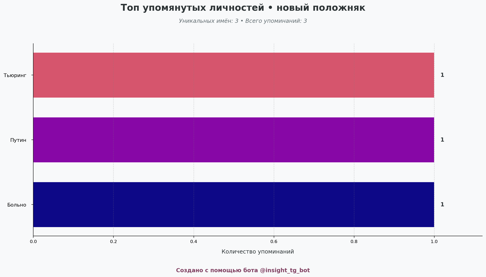
  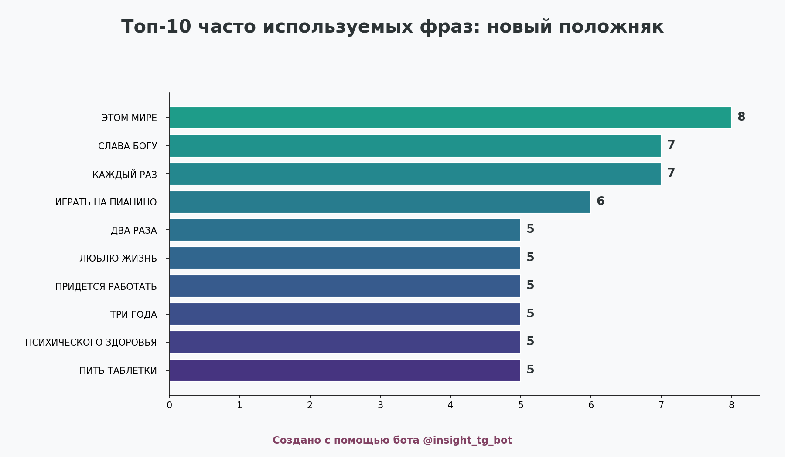
</p>
<p align="center">
  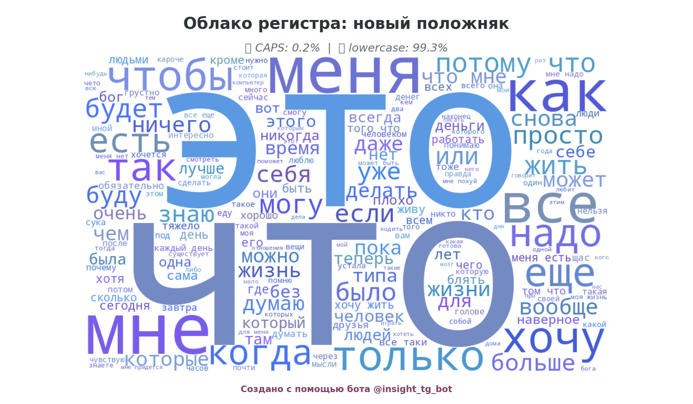
  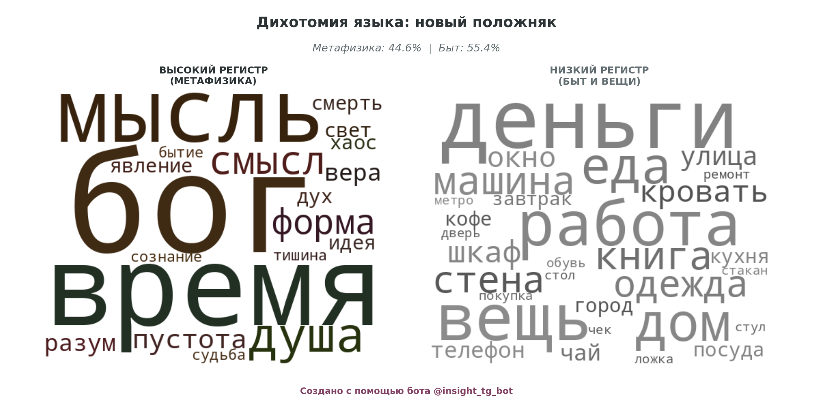
</p>

## Features

- **Word Cloud** — key topics visualization
- **Top 15 Words** — word frequency chart
- **Profanity Cloud** — profanity analysis with false positive filtering
- **Sentiment Clouds** — positive & negative word clouds
- **Weekday Stats** — average post length by day
- **Hourly Activity** — posting time distribution
- **Activity Heatmap** — hour × weekday heatmap
- **Top Names** — mentioned people (NER via Natasha)
- **Top Phrases** — frequent trigrams
- **Top Emoji** — most used emoji
- **Register Analysis** — CAPS vs lowercase ratio
- **Dichotomy Chart** — formal vs informal, long vs short, etc.
- **PDF Export** — full report as PDF

### Two Modes

| | Lite (free) | Full (paid) |
|---|---|---|
| Method | Web scraping | Telethon API |
| Charts | Word cloud only | All 12 charts |
| Posts | Up to 50 | Up to 500 |
| Speed | ~10 sec | ~30 sec |

### Monetization

Payments via **Telegram Stars** with A/B price testing (2 groups).

## Tech Stack

| Component | Library |
|---|---|
| Bot framework | aiogram 3.x |
| Telegram client | Telethon (pool of 3 accounts) |
| NLP | pymorphy3, Natasha NER, NLTK |
| Visualization | matplotlib, wordcloud |
| Database | SQLite (WAL mode) |
| Monitoring | Prometheus, Sentry |
| PDF | matplotlib PdfPages |

## Architecture

```
main.py              — entry point, background tasks
config.py            — settings from .env
db.py                — SQLite: users, payments, pending queue
analyzer.py          — analysis pipeline (Telethon + web scraping)
client_pool.py       — 3 Telethon accounts, rotation, cooldown, cache
handlers/
  ├── common.py      — rate limiting, keyboards, A/B test
  ├── user.py        — /start, /help, channel analysis
  ├── payments.py    — Telegram Stars payments
  └── admin.py       — /admin, /broadcast, /stats
nlp/
  ├── processor.py   — lemmatization (pymorphy3) + NER (Natasha)
  └── constants.py   — stop words, sentiment dictionaries
visualization/
  ├── charts.py      — 12 chart types (thread-safe, OOP API)
  ├── wordclouds.py  — word clouds
  └── pdf_export.py  — PDF report generation
```

## Setup

### 1. Clone & install

```bash
git clone https://github.com/kristnoir-gif/insight-tg-bot.git
cd insight-tg-bot
pip install -r requirements.txt
python -c "import nltk; nltk.download('punkt'); nltk.download('punkt_tab'); nltk.download('stopwords')"
```

### 2. Configure

```bash
cp .env.example .env
```

Edit `.env`:

```env
API_ID=your_api_id          # https://my.telegram.org/apps
API_HASH=your_api_hash
BOT_TOKEN=your_bot_token    # from @BotFather
SESSION_NAME=user_session
```

### 3. Create Telethon session

On first run, Telethon will ask for phone number and auth code:

```bash
python3 main.py
```

### 4. Run

```bash
python3 main.py
```

Health check: `http://localhost:8080/health`

## Testing

```bash
pip install pytest
python3 -m pytest tests/ -x -q
```

CI runs on Python 3.11 and 3.12 via GitHub Actions.

## Deployment

The bot runs as a systemd service. Example unit file included: `tg-bot.service`.

```bash
# Copy to server
rsync -avz --exclude-from='.gitignore' . server:/opt/bot_tg/

# Enable service
sudo cp tg-bot.service /etc/systemd/system/
sudo systemctl enable --now tg-bot
```

> **Note:** Requires `fonts-dejavu-core` on the server for matplotlib charts.

## Key Design Decisions

- **Account pool** — 3 Telethon accounts with automatic rotation on FloodWait, priority queue for pending analyses
- **Two-level cache** — in-memory + disk (`cache/` directory) to minimize API calls
- **Thread-safe charts** — matplotlib OOP API only (`fig.savefig()`, never `plt.savefig()`) to avoid race conditions in async workers
- **Atomic payments** — single transaction for balance update + payment record, admin notification on failure
- **NLP lazy loading** — pymorphy3/Natasha models (~2s) loaded on first use, not at import time

## License

MIT
